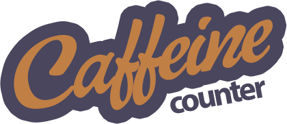
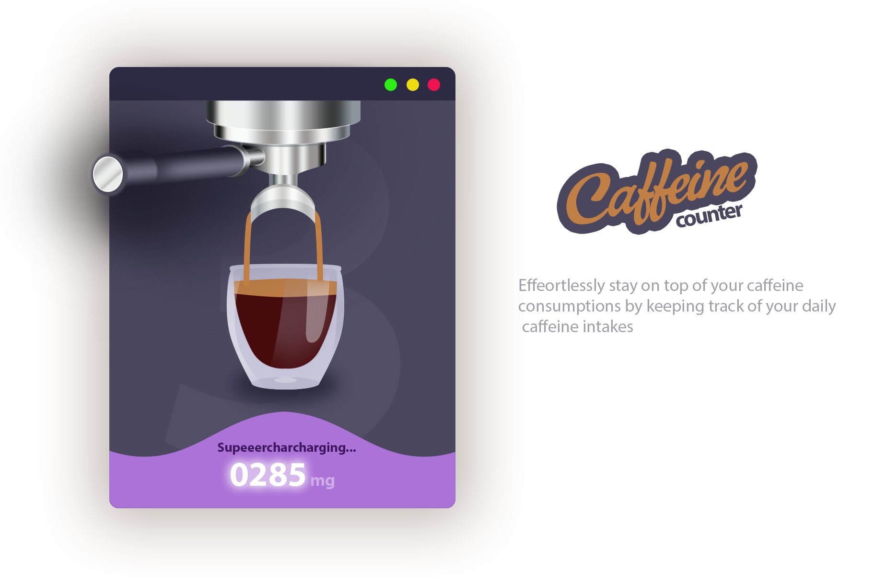
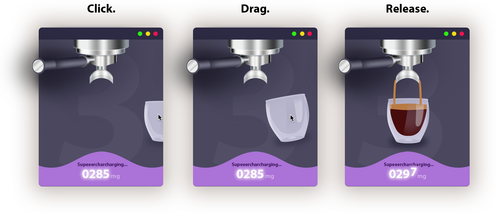

<!-- 
 -->

# Caffeine counter
> keep track of your daily caffeine intakes

Caffeine counter is a simple widget that allows you to keep track of your daily caffeine intakes for the long days in the office. 

    

## Features

- **Coffee counter:** Counts the coffee cups drank during the current day
- **Caffeine counter:** Calculates your daily caffeine consumptions
- **Beautilful&Simple:** Just click or drag to add a coffee cup to the drank queue
- **Auto-reset:** Automatically reset your stats every day according to your timezone
- **Custom user-settable messages:** Customize your messages and threasolds for coffee milestones!

## Documentation

Caffeine counter is built with user-centered design in mind, to allow fast and easy caffeine tracking for the _bravest_ office workers.
   

    

### Animations

Caffeine counter is packed with beautifully interactive animations with elastic-like effects.

    

## Built with

-  [Vuex](https://vuex.vuejs.org/)
- [Electronjs](https://electronjs.org/) 
- [Python-shell](https://www.npmjs.com/package/python-shell)

## License

This project is licensed under the MIT License - see the [LICENSE.md](LICENSE) file for details

